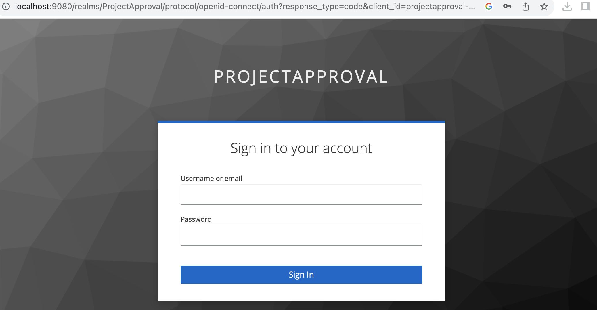

Centralised authentication for micro-services with Spring Boot 3.2 and Keycloak 22.0.5
======================================================================================

 

In 1987, my father brought home our family's third car, a sleek green Subaru.
This vehicle marked a departure from our previous rides, boasting a distinctly
modern flair in both design and features. Among its standout attributes was the
revolutionary centralized locking system. Unlike our previous cars, where we,
the passengers, were tasked with manually locking the doors before each journey,
this Subaru introduced a new level of convenience. From the driver's seat, my
father could effortlessly secure the entire car with a single action—truly,
automotive magic!

 

During that era, centralized car locking wasn't as ubiquitous as it is today.
However, the brilliance of the concept endured and eventually became a standard
feature in contemporary vehicles.

Drawing a parallel to automotive innovation, the concept of centralized
authentication for applications and systems emerged as a transformative idea.
Much like centralized car locking, it introduced the convenience of a single
control point for managing a diverse landscape of applications and systems,
spanning global data centers.

 

In the earlier days of computing, each system stored its own set of usernames
and passwords. The advent of technologies like LDAP and Active Directory
revolutionized this landscape, offering organizations the ability to centrally
manage user information and passwords. Described colloquially as having a
'single throat to choke,' these systems became indispensable for mid to large
organizations. Today, LDAP and Active Directory stand as integral components of
any enterprise's architecture, and any systems designed for such environments
must accommodate both to align with standard practices in enterprise
architecture.

 

Expanding on the evolution of centralized authentication, the landscape
witnessed further advancements with the introduction of OpenID Connect (OIDC)
and OAuth 2.0. These protocols brought about a paradigm shift in how identity
and authorization were handled in the digital realm. OAuth 2.0, focusing
primarily on authorization, introduced a standardized framework for granting
access to resources without divulging user credentials. It became the go-to
solution for securing APIs and enabling third-party applications to access
protected resources on behalf of users.

 

Complementing OAuth 2.0, OpenID Connect emerged as an authentication layer,
providing a secure mechanism for verifying the identity of end-users. Its
integration with OAuth 2.0 formed a powerful duo, enabling developers to
implement robust, secure, and user-friendly authentication and authorization
processes. OpenID Connect introduced user authentication through identity
providers, offering a standardized way to authenticate users across different
applications, reducing the burden of managing diverse authentication mechanisms.

 

Much like LDAP and Active Directory transformed user management, OIDC and OAuth
2.0 have become pivotal in the contemporary digital landscape. These protocols
have found widespread adoption, becoming integral components in the architecture
of applications and systems that prioritize security, scalability, and seamless
user experiences. As technology continues to evolve, the principles introduced
by OIDC and OAuth 2.0 are shaping the future of identity and access management
in the ever-expanding digital ecosystem.

 

In this blog, we will get our hands dirty with implementing micro-services
centralised authentication using Spring Boot 3.1 and Keycloak 22.0.5. With
Spring Boot 3.2, the APIs to integrate Keycloak and Spring Boot has been updated
again (This is probably the 2nd time these APIs are updated).

 

 

The architecture
----------------

The architecture we propose comprises a diverse array of applications seamlessly
integrated into an enterprise framework. Each application is designed with its
unique set of business processes, ranging from straightforward to intricate.
These business processes are executed and monitored by distinct roles within the
organization.

 

At the heart of this sophisticated enterprise architecture lies the centralized
authentication system. This pivotal system serves as the guardian of all
user-related information, including usernames, passwords, first and last names,
work titles, and more. It functions as the centralized hub for managing and
maintaining this critical user data. Furthermore, the centralization extends to
the assignment of roles to various business processes; these roles are
meticulously mapped to individual users within the centralized authentication
system. Essentially, the system acts as the nerve center, overseeing and
managing the intricate web of user roles, ensuring a seamless and secure
orchestration of business processes across the enterprise.

For this particular blog, we will reimplementing the architecture above but in a
very simplified manner as per below:

 

 

We will use a project management system as an example. In this system, a project
can be requested. The project can then be approved. There are 2 roles here: the
project requestor (ProjectRequestor) and the a-project approver
(ProjectApprover)

 

Grant types
-----------

OAuth2 supports various authentication flows, also known as grants.
Authentication flows represent different methods for authenticating a user. For
the purpose of this tutorial, we will delve into two specific types: the
standard flow and the direct access grant.

 

### Standard flow

In the standard flow, when a user attempts to log in, the application redirects
the user to a Centralized Authentication service. The user then logs in there,
and if successful, is redirected back to the application's page.

The standard flow is considered more secure than the direct access grant and is
primarily employed for websites.

For our tutorial, we will employ the standard flow for ProjectApprover to query
the list of projects.

A simplified sequence of the standard flow is outlined below:

### Direct access grant

In the direct access grant, a user is required to obtain an access token, and
for each interaction with the application, this access token must be supplied.

This grant type is typically employed for authenticating direct API calls, such
as those originating from a mobile application.

For the purposes of this tutorial, we will leverage the direct access grant for
ProjectRequestor.

A simplified sequence for the direct access grant is outlined below:

Keycloak
--------

### Creating realm and client

In our implementation, we will run Keycloak v22.0.5 (latest at the time of this
writing). Let us install Keycloak on our Docker

 

>   Note: I’m running Docker on my laptop and the whole tutorial is based soon
>   this. You may find how to install Keycloak using other methods in the
>   Getting Started Guide <https://www.keycloak.org/guides>

 

-   Fire up your command line console and run the command below. This will
    install and run Keycloak. Once done, Keycloak will be available at
    `http://localhost:9080` with username: admin and password: admin

~~~~~~~~~~~~~~~~~~~~~~~~~~~~~~~~~~~~~~~~~~~~~~~~~~~~~~~~~~~~~~~~~~~~~~~~~~~~~~~~
> docker run -d -p 9080:8080 -e KEYCLOAK_ADMIN=admin -e KEYCLOAK_ADMIN_PASSWORD=admin quay.io/keycloak/keycloak:22.0.5 start-dev 
~~~~~~~~~~~~~~~~~~~~~~~~~~~~~~~~~~~~~~~~~~~~~~~~~~~~~~~~~~~~~~~~~~~~~~~~~~~~~~~~

 

-   Fire up your browser and point it to `http://localhost:9080`. Click on the
    Administration Console link and log in with the user name and password above

-   On the landing page, click the drop down list on the left and choose Create
    Realm.

-   Create a Realm called ProjectApproval and click on Create. ProjectApproval
    is our application

-   The realm ProjectApproval will be created. In the realm page, click on
    Clients and click on Create

-   Create a client called “projectapproval-client” and Next

-   Make sure Direct Access Grant and Standard Flow are selected

-   Enter projectapproval-client in the Client ID

-   Fill in the form:

    Root URL = http://localhost:18080

    Valid redirect URIs = \* . This would mean we can redirect into any URI. You
    may want to restrict this in production

    Valid post logout redirect URIs = + . This would mean we copy Valid redirect
    URL

    Web origins = \* . Determine the CORS web origin allowed. You may want to
    restrict this in production. Quoting Keycloak documentation

    >   This option handles [Cross-Origin Resource Sharing
    >   (CORS)](https://fetch.spec.whatwg.org/). If browser JavaScript attempts
    >   an AJAX HTTP request to a server whose domain is different from the one
    >   that the JavaScript code came from, the request must use CORS. The
    >   server must handle CORS requests, otherwise the browser will not display
    >   or allow the request to be processed. This protocol protects against
    >   XSS, CSRF, and other JavaScript-based attacks.

    >   Domain URLs listed here are embedded within the access token sent to the
    >   client application. The client application uses this information to
    >   decide whether to allow a CORS request to be invoked on it. Only
    >   Keycloak client adapters support this feature

 

-   Click Save to create the client

-   For more detailed configuration, please see
    <https://www.keycloak.org/guides#server>

 

### Creating roles

There are 2 types of roles possible in Keycloak, Realm Roles and Client Roles

Realm roles: global within the entire Keycloak realm.

Client roles: specific to a particular client in the realm

-   For generic access role, we will use Realm Roles,

-   On the side menu click Realm Roles. Then click on the button Create role

-   Create the role "user"

-   For the application itself, we choose to use client roles instead of realm
    roles since it is more restrictive in nature.

-   From the client page, select the Roles tabard create 2 roles:
    ProjectApprover and ProjectRequestor

 

Creating user

-   Create a user with the username jean.grey as per below. Click soon the
    button Create

-   When the user is created, the user page will be shown. Firstly, on the
    Details tab, choose Email verified

-   Under the Tab credential, click on Set password and set the user’s password.

-   Make sure Temporary is turned off. Click Save and Save again to save the
    password

-   Now we will associate the user with the roles (both realm and client roles)

-   Under the Role Mapping tab of the user page, click on Assign role

-   Choose all roles presented and click on Assign

-   Click on Assign role again in the Assign Role tab of the user page. This
    time around, click on Filter by Clients. Choose ProjectRequestor

-   In final tally of roles for the user jean.grey, we should have something as
    per below:

-   Create a user with username charles.xavier. This time around, assign the
    role of ProojectApprover instead

 

Application Design
------------------

 

### Starting with an existing application

In the interest of brevity and focus, we will start with an existing
application. The application can be found here. It is basically a simple Spring
Boot + Spring Data application.

The application accommodates 2 roles: Project Creator and Project Viewer. A
Project Creator, calling the POST method on
http://localhost:18080/projectrequest, can create a project. The Project Viewer,
calling the GET method on the same URL will be able to see all projects.

 

The source code is here (Note that this is an earlier version of the code before
Keycloak is integrated into the project):

<https://github.com/azrulhasni/projectmgmtsystem/tree/3ea8a345d38d535a883fdc449200ddfff41f8af0>

 

Download the source code from the Github link above and unzip it in a folder.
Let’s call the parent folder \$PARENT (On macOS, \$PARENT could point to
/Users/\<user name\>/projectmgmtsystem for example. On Windows, \$PARENT could
point to C:/Users/\<user name\>/projectmgmtsystem for example)

 

Under \$PARENT, we should have the folder structure as such:

 

 

 

### What we will do

We will protect the access points of the application (i.e. the GET and POST
methods above)

 

### Dependencies

-   Open up \$PARENT/pom.xml and add the dependencies below:

~~~~~~~~~~~~~~~~~~~~~~~~~~~~~~~~~~~~~~~~~~~~~~~~~~~~~~~~~~~~~~~~~~~~~~~~~~~~~~~~
<dependencies>
        <dependency>
            <groupId>org.springframework.boot</groupId>
            <artifactId>spring-boot-starter-security</artifactId>
        </dependency>
        <dependency>
            <groupId>org.springframework.boot</groupId>
            <artifactId>spring-boot-starter-oauth2-client</artifactId>
        </dependency>
        <dependency>
            <groupId>org.springframework.boot</groupId>
            <artifactId>spring-boot-starter-oauth2-resource-server</artifactId>
        </dependency>
        <dependency>
            <groupId>com.nimbusds</groupId>
            <artifactId>nimbus-jose-jwt</artifactId>
            <version>9.36</version>
        </dependency>

    ...
<dependencies>
~~~~~~~~~~~~~~~~~~~~~~~~~~~~~~~~~~~~~~~~~~~~~~~~~~~~~~~~~~~~~~~~~~~~~~~~~~~~~~~~

-   The resulting pom.xml should have dependencies to the libraries below:

    -   **Spring Data JPA**

    -   **OAuth2 Client**

    -   **OAuth2 Resource Server**

    -   **Spring Web**

    -   **H2 Database**

    -   **Spring Security**

     

-   Recall the 2 OAuth2 flows in the paragraph above. In order for us to
    implement these flows in our application we need the libraries:

    -   OAuth2 Client : For standard flow

    -   OAuth2 Resource Server : For direct access grant

     

### Configuration

 

-   Open up \$PARENT/src/main/resources/application.properties file and add the
    lines below

~~~~~~~~~~~~~~~~~~~~~~~~~~~~~~~~~~~~~~~~~~~~~~~~~~~~~~~~~~~~~~~~~~~~~~~~~~~~~~~~
spring.security.oauth2.resourceserver.jwt.issuer-uri=http://localhost:9080/realms/ProjectApproval
spring.security.oauth2.resourceserver.jwt.issuer-uri.jwk-set-uri=http://localhost:9080/realms/ProjectApproval/protocol/openid-connect/certs

spring.security.oauth2.client.registration.keycloak.client-id=projectapproval-client
spring.security.oauth2.client.registration.keycloak.authorization-grant-type=authorization_code
spring.security.oauth2.client.registration.keycloak.scope=openid
spring.security.oauth2.client.provider.keycloak.issuer-uri=http://localhost:9080/realms/ProjectApproval
spring.security.oauth2.client.provider.keycloak.user-name-attribute=preferred_username

jwt.auth.converter.resource-id=projectapproval-client
jwt.auth.converter.principal-attribute=preferred_username
~~~~~~~~~~~~~~~~~~~~~~~~~~~~~~~~~~~~~~~~~~~~~~~~~~~~~~~~~~~~~~~~~~~~~~~~~~~~~~~~

 

-   Under the folder \$PARENT/src/main/java/com/azrul/keycloak/projectmgmtsystem
    , add another folder called config.

-   In the folder
    \$PARENT/src/main/java/com/azrul/keycloak/projectmgmtsystem/config, add the
    files below:

    -   JwtAuthConverter.java

    -   JwtAuthConverterProperties.java

    -   KeycloakLogoutHandler.java

    -   RestTemplateConfig.java

    -   SecurityConfig.java

    These files can be found at
    [<https://github.com/azrulhasni/projectmgmtsystem/tree/master/src/main/java/com/azrul/keycloak/projectmgmtsystem/config>]

-   We will not deep dive into every file but we will investigate one of them:
    SecurityConfig.java - mainly the method `securityFilterChain.`

1.  This is where we set the permission of access. In our case, the default path
    (`/`) is accessible to all (`permitAll()`). The `/projectrequest*` path on
    the other hand is only accessible by `OIDC_USER`. The role `OIDC_USER`
    corresponds to the role “user” in Keycloak.

1.  This is where out logout processor is configured

2.  Recall that the library OAuth2 Client is needed for standard flow. This is
    where we configure the support for standard flow

3.  Recall that the library OAuth2 Resource Server is needed for direct access
    grant. This is where we configure the support for direct access grant

 

### Applying the roles

-   Now that everything is configured correctly, let us apply the roles to our
    Controllers. Note that we can use standard annotations to allow/disallow
    access by certain roles to certain method in the controller. In this
    tutorial, we would do this programatically instead

-   Open the file ProjectRequestController.java from the folder
    \$PARENT/src/main/java/com/azrul/keycloak/projectmgmtsystem/controller.

-   Update the methods`addProject` and `queryProjects`as per below. We can see
    that access is only given to the appropriate roles:

 

~~~~~~~~~~~~~~~~~~~~~~~~~~~~~~~~~~~~~~~~~~~~~~~~~~~~~~~~~~~~~~~~~~~~~~~~~~~~~~~~
    @PostMapping(path = "/projectrequest")
    public String addProject(ProjectRequest project){
        Authentication authentication = SecurityContextHolder
            .getContext().getAuthentication();
        Set<String> roles = authentication
            .getAuthorities().stream().map(r 
                -> r.getAuthority()).collect(Collectors.toSet());
        if (roles.contains("ProjectRequestor")){
            projectRequestDAO.save(project);
            return "SUCCESS";
        }else{
            return "FAIL";
        }
    }

    @GetMapping(path = "/projectrequest")
    public List<ProjectRequest> queryProjects() {
        Authentication authentication = SecurityContextHolder
            .getContext().getAuthentication();
        Set<String> roles = authentication
            .getAuthorities().stream().map(r 
                -> r.getAuthority()).collect(Collectors.toSet());
        if (roles.contains("ProjectApprover")){
            return projectRequestDAO.findAll();
        }else{
            return List.of();
        }
    } 
~~~~~~~~~~~~~~~~~~~~~~~~~~~~~~~~~~~~~~~~~~~~~~~~~~~~~~~~~~~~~~~~~~~~~~~~~~~~~~~~

 

 

 

Running and testing our application
-----------------------------------

To run the application, go to the \$PARENT folder and run the command line
below:

~~~~~~~~~~~~~~~~~~~~~~~~~~~~~~~~~~~~~~~~~~~~~~~~~~~~~~~~~~~~~~~~~~~~~~~~~~~~~~~~
> ./mvnw spring-boot:run
~~~~~~~~~~~~~~~~~~~~~~~~~~~~~~~~~~~~~~~~~~~~~~~~~~~~~~~~~~~~~~~~~~~~~~~~~~~~~~~~

 

Once completed, we can test our application

 

### Testing creating a project request

Let us call our API to create a project.

-   Firstly, let get an access token. In a command line console, run the command
    below:

~~~~~~~~~~~~~~~~~~~~~~~~~~~~~~~~~~~~~~~~~~~~~~~~~~~~~~~~~~~~~~~~~~~~~~~~~~~~~~~~
> curl -X POST 'http://localhost:9080/realms/ProjectApproval/protocol/openid-connect/token'  --header 'Content-Type: application/x-www-form-urlencoded'  --data-urlencode 'grant_type=password'  --data-urlencode 'client_id=projectapproval-client'  --data-urlencode 'username=jean.grey'  --data-urlencode 'password=abc123'
~~~~~~~~~~~~~~~~~~~~~~~~~~~~~~~~~~~~~~~~~~~~~~~~~~~~~~~~~~~~~~~~~~~~~~~~~~~~~~~~

-   The reply would be a huge json as per below. Copy the `“access_token”`
    (eyJhbGciOi … to the end)

~~~~~~~~~~~~~~~~~~~~~~~~~~~~~~~~~~~~~~~~~~~~~~~~~~~~~~~~~~~~~~~~~~~~~~~~~~~~~~~~
{"access_token":"eyJhbGciOi...","expires_in":300,"refresh_expires_in":1800,"refresh_token":"eyJhbGciOiJ...","token_type":"Bearer","not-before-policy":1702474660,"session_state":"00aa6a74-e264-49c0-bc60-7daab06bc77b","scope":"profile email"}
~~~~~~~~~~~~~~~~~~~~~~~~~~~~~~~~~~~~~~~~~~~~~~~~~~~~~~~~~~~~~~~~~~~~~~~~~~~~~~~~

-   Then run the command below. Note that the access token copied above must be
    pasted after the word `Bearer`in the command (replace the string eyJhbGciOi
    …)

~~~~~~~~~~~~~~~~~~~~~~~~~~~~~~~~~~~~~~~~~~~~~~~~~~~~~~~~~~~~~~~~~~~~~~~~~~~~~~~~
curl --location --request POST 'localhost:18080/projectrequest' \
--header 'Authorization: Bearer eyJhbGciOi ...' \
--header 'Content-Type: text/plain' \
--header 'Cookie: JSESSIONID=2D2BE2659A7938757D748FFFD2B3C108' \
--data-raw '{"projectName":"Project Y","startDate":"2023-12-14","budget":20000,"approved":null}'
~~~~~~~~~~~~~~~~~~~~~~~~~~~~~~~~~~~~~~~~~~~~~~~~~~~~~~~~~~~~~~~~~~~~~~~~~~~~~~~~

-   This will create a new project and store it in our database

 

### Testing querying projects

Recall that to query the project, we want to use the standard flow. For this, we
should use our browser.

-   Point our browser (use the incognito mode if you do not want the browser to
    remember your login) to http://localhost:18080/projectrequest. We will be
    redirected to the login page below. Note that the URL is now pointing to
    Keycloak (port 9080) and not our application (port 18080) anymore

-   Log in using the credential charles.xavier / abc123. We use charles.xavier
    because the role is ProjectApprover

-   Just for fun, let’s do a negative test. Point our browser (incognito mode)
    to http://localhost:18080/projectrequest once again and this time log in as
    jean.grey/abc123. You will see that an empty list is returned instead

Conclusion
----------

In this short tutorial, we have learnt how to set up a centralised
authentication system that held both user information and user roles

We have also learnt about OAuth2 flows and where to implement them

We then moved into implementing these using the latest Keycloak and Spring Boot
setup. Demonstrating these concepts using a dummy Project Management System
application
